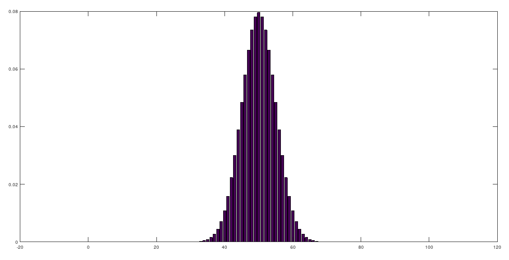
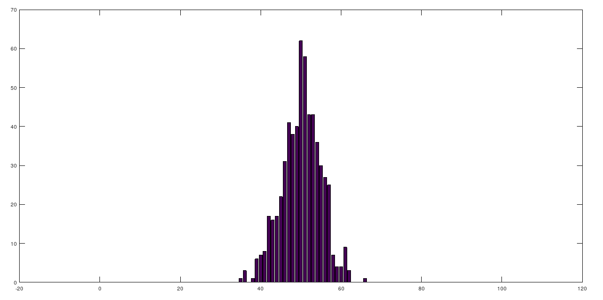
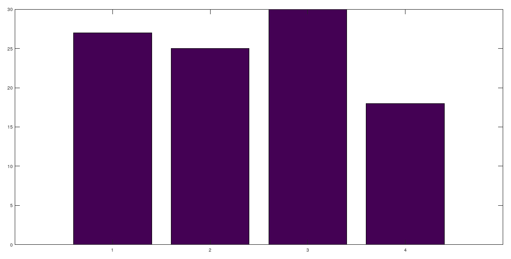
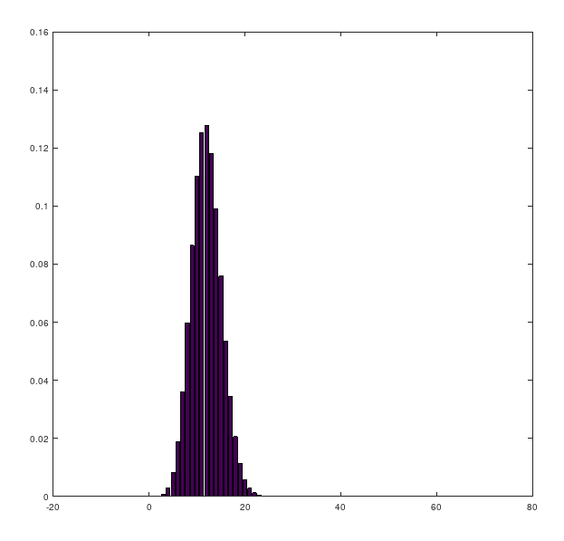
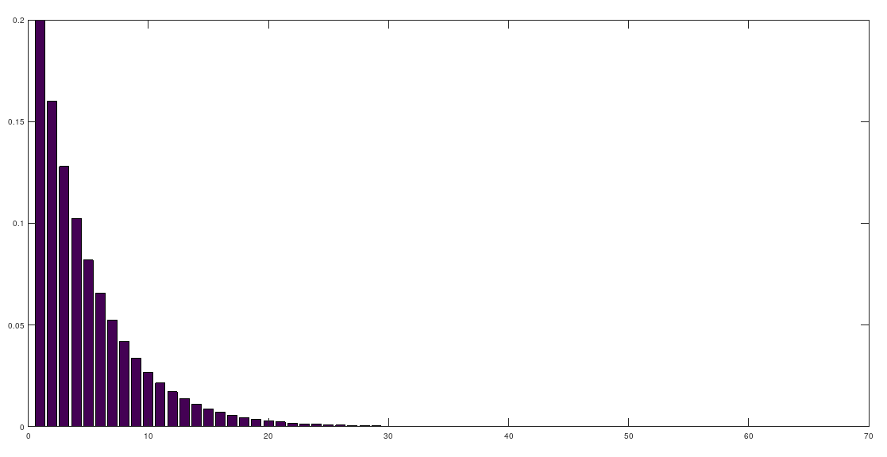
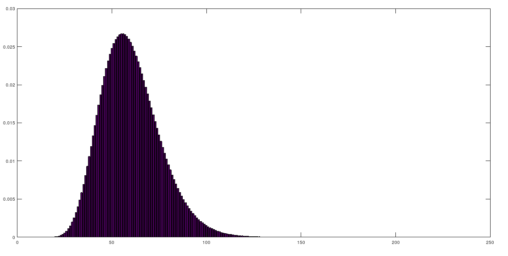

# 學習MATLAB
此課程是使用MATLAB 2019a，學習的內容儲存到這個儲存庫，並提供大家檢閱與更新，讓範例可以接近完整。

發現學習的網站列表:

- [MATLAB and Simulink Training](https://matlabacademy.mathworks.com/)
- [自學專區](https://www.terasoft.com.tw/Academia/index.asp)
- [MATLAB教學](https://www.youtube.com/playlist?list=PLVHBjRDK0kALcQMwAFbR5q2driYZCHNIx)

由MatlabWorks官方所提供的教學網站[MATLAB and Simulink Training](https://matlabacademy.mathworks.com/)，提供基礎學習並搭配網頁互動式學習，從中完成所有初階課程學習，學習過程會在裡面記錄下來。MatlabWorks裡面所提供的課程都是製作出最新的產品，如果基礎學習完成還可以得到基本認證，但想要學習其他課程必須付錢，但可以透果網路上其他教學影片或者[自學專區](https://www.terasoft.com.tw/Academia/index.asp)來學習進階課程。

自學專區是由出版社所整理資源，此資源包括新舊、難易等所有資源，並代理許多MATLAB相關套件與教學。其中著名的教授也在此公司出版最早有關MATLAB有關的工具，並也在MATLAB公司工作過，因此對MATLAB很熟悉。

MATLAB教學是一位台大生物機械系郭彥甫教授所提供的教學，雖然教學相當完整但使用的MATLAB是MATLAB 2014a，可能使用新版的MATLAB再進階課程會有不同與棄用部份。

# 符號運算
在 Octave 使用符號運算時，會出現錯誤，此時可以通過安裝新的套件與匯入方法解決。

```matlab
pkg install -forge symbolic
```

匯入套件

```matlab
pkg load symbolic
```

# 機率學應用
將機率所學事物寫在此。

## 硬幣模擬
可以透過 `rand(1, 4)` 產生小於 1 隨機數字的數字四個，放入到 `x` 內。

```matlab
>> x = rand(1, 4)
x =

   0.1868   0.8280   0.7997   0.4883

```

再來可以透過 `x < 0.5` 來產生硬幣一半一半的機率。

```matlab
>> x < 0.5
ans =

  1  0  0  1

```

## 學生成績產生
用 `50 + randi(50, 1, 12)` 方式，產生12筆大於50分的成績。

```matlab
ans =

    71    55    96    59    98    84    59    93    99    97   100    90

```

## 擲骰子
通過 `randi(6, 1, 10)` 擲骰子十次，可以得到擲骰子的結果。

```matlab
ans =

   5   6   3   5   4   5   6   4   3   5

```

`rng` 可以用來設定種子，是每個亂數產生都會有的，可以通過種子來設定隨機值產生的方式，以及透過實驗時的種子讓其他人在做測試的時候可以還原當時的亂數。

由於在 Octave 沒有 `rng` 函式，因此要使用 Octave 產生器，此方法是否可以通用 MATLAB 還有帶觀察。

使用 `rand("state")` 來取得種子，取得的資料是625列的種子數值，再透過 `rand("state", s)` 設定種子， `s` 要放 `rand("state")` 回傳值。

```matlab
s = rand("state")
50 + randi(50, 1, 12)
rand("state", s)
50 + randi(50, 1, 12)
```

執行結果

```matlab
>> s = rand("state")
s =

  2795783892
  ...
  3785941655
         599

>> 50 + randi(50, 1, 12)
ans =

    70    87   100    98    78    73    64    52    52    74    66    70

>> rand("state", s)
>> 50 + randi(50, 1, 12)
ans =

    70    87   100    98    78    73    64    52    52    74    66    70

```

*註： `seed` 為 Octave 舊式產生器，一樣可以使用，但測試新的好像不能使用。

## example 2.8

```matlab
>> n = factorial(52) / (factorial(52 - 7) * factorial(7))
n = 1.3378e+08
```

```matlab
>> f=factorial(11)/(factorial(11-5)*factorial(5))
f = 462
```

```matlab
>> f=factorial(120)/(factorial(120-60)*factorial(60))
f = 9.6615e+34
```

```matlab
>> f=factorial(15)/(factorial(15-8)*factorial(8))
f = 6435
>> n=factorial(10)/(factorial(10-1)*factorial(1))
n = 10
>> n*f
ans = 64350
>> m = factorial(9)
m = 362880
>> n * f * m
ans = 2.3351e+10
```

## example 2.9

```matlab
>> n = factorial(48)/(factorial(48-7)*factorial(7))
n = 7.3629e+07
>> m = factorial(52) / (factorial(52 - 7) * factorial(7))
m = 1.3378e+08
>> n / m
ans = 0.5504
```

## example 2.10

```matlab
>> (48 / 52) ^ 7
ans = 0.5710
```

## example 2.15

```matlab
>> y = factorial(10) / (factorial(2) * factorial(3) * factorial(3) * factorial(2))
y = 25200
```

## 機率分佈圖
### 繪製投擲硬幣的機率分佈圖
透過機率學的理論數值，繪製分佈圖。

```matlab
for k=0:100
  p(k + 1) = 0.5 ^ 100 * factorial(100) / (factorial(100 - k) * factorial(k));
end

bar([0:100], p)
```



### example 2.19
實際模擬投擲硬幣，來計算每次產生的機率，並繪製投擲硬幣的機率分佈圖。

```matlab
x = rand(100, 600) < 0.5;
y = sum(x, 1);
t = 0:100;
h = hist(y, t);
bar([0:100], h)
```



### example 2.20
找出指定數值發生的機率

`ceil` 指天花板，透過此函數，可以將大於整數的浮點數無條件進位，因此得到整數。

使用 `hist` 來找出某集合內指定發生的事件機率。

```matlab
g = ceil(4 * rand(1, 100));
t = 1:4;
x = hist(g, t);
bar([1:4], x)
```



# 隨機變數
## Binomial

```matlab
p = 0.2;
n = 60;
for m=0:n
  y(m + 1) = binomialpmf(n, p, m);
end
bar([0:n], y)
```



## Geometric

```matlab
p = 0.2;
for m = 1:60
  y(m) = geometricpmf(p, m);
end

bar(y);
```



## Pascal

```matlab
p = 0.2;
k = 12;
n = 200;
y = zeros(1, n);
for m = k:n
  y(m) = pascalpmf(k, p, m);
end

bar([1:n], y);
```



# 離散機率
## Poisson
「卜瓦松分布」(Poisson distribution)又稱Poisson分布、泊松分布、布瓦松分布、布阿松分布、普阿松分布、波以松分布、卜氏分布、帕松小數法則，是一種統計與機率學裡常見到的離散機率分布，由法國數學家西莫恩·德尼·卜瓦松在1838年時發表。

Poisson 過程有三個基本特性：

1. 在一個短時間區間 $\Delta t$ 內，發生一次事件的機率與 $\Delta t$ 成正比： $\lambda \Delta t$。
2. 在短時間內發生兩次以上的機率可以忽略。
3. 在不重疊的時間段落裡，事件各自發生的次數是獨立的。

```math
b(x; n, p) = \frac {n!}{x!(n-x)!}p^x(1-p)^{n-x}
```

假定某機關的總機在一個短時間 $\triangle t$ 內會接到一次電話的機率 $p$ 與 $\triangle t$ 成正比： $p=\alpha\triangle t$，$\alpha$ 為一常數。又假定在此短時間內接到多於一次電話的機率微乎其微，可以略去不計。那麼在時間 $t$ 內，會接到 $x$ 次電話的機率分布為何？

我們可以把 $t$ 分成 $n$ 小段，每小段長為 $\triangle t=\frac{t}{n}$。整個問題可看成為：

> 在每個 $\triangle t$ 時間內，我們做了一次試驗，其成功（接到電話）的機率為 $p$ 。如此做了 $n$ 次，那麼成功了 $x$ 次的機率為何？所以我們要的機率分布正是二項分布 $b(x;n,p)$ 。令 $\lambda = \alpha t = n\alpha\triangle t = np$ ，則

```math
\begin{equation}
\begin{split}
&b(x;n,p)\\
& = \frac{n!}{x!(n-x)!}p^x(1-p)^{n-x}\\
& = \frac{n(n -1)(n -2)\cdots(n - x + 1)}{x!}(\frac{\lambda}{n})^x(1-\frac{\lambda}{n})^{n-x} \\
& = (1 - \frac{1}{n})(1 - \frac{2}{n})\cdots(1 - \frac{x - 1}{n})\frac{1}{x!}\lambda^{x}((1 - \frac{\lambda}{n})^{-\frac{n}{\lambda}})^{-\lambda}(1-\frac{\lambda}{n})^{-x}
\end{split}
\end{equation}
```

當 t 保持不變（亦即 λ 不變），而讓 $n\rightarrow\infty$ ( $4t \rightarrow 0$)，則

```math
\begin{equation}
\begin{split}
& (1 - \frac{1}{n})(1-\frac{2}{n})\cdots(1 - \frac{x-1}{n})\rightarrow 1 \\
& (1 - \frac{\lambda}{n})^{- \frac{n}{\lambda}} \rightarrow e \\
& (1-\frac{\lambda}{n})^{-x}\rightarrow 1
\end{split}
\end{equation}
```

所以

$b(x;n,p) \rightarrow \frac{\lambda^xe^{-\lambda}}{x!}$ (以 $p(x;\lambda)$ 表之，此處的 $p$ 代表 Poisson)

因為

```math
\begin{equation}
\begin{split}
\sum_{x=0}^{\infty}p(x;\lambda)=e^{-\lambda}\sum_{x=0}^{\infty}\frac{\lambda^x}{x!}=e^{-\lambda}e^{\lambda}=1
\end{split}
\end{equation}
```

所以 $p(x;\lambda)$ 的確是個機率分布(各種可能的機率之和等於 $1$ )。

這就是說，在時間 $t$ 內，接到 $x$ 次電話的機率為 $p(x;\lambda)$ 。這是以 $\lambda$ 為參數的 Poisson 分布，而 $\lambda=\alpha t$ 是在時間 $t$ 內所期望接到的電話數。

### 範例

```matlab
a = 0.5;
x = 5;
for i = 0:x
  y(i+1) = poissonpmf(a, i)
end

e = 0;
for i = 0:x
  y(i + 1) = poissonpmf(a, i);
  e = e + i * y(i + 1);
end
```

輸出

```matlab
>> e
e = 0.4999
```


```matlab
a = 1;
x = 10;
for i = 0:x
  y(i + 1) = poissonpmf(a, i)
end

e = 0;
for i = 0:x
y(i+1) = poissonpmf(a, i);
e = e + i * y(i + 1);
end
```

輸出

```matlab
> e
e  =  1.0000
```


```
a = 5
x = 50
for i = 0:x
y(i+1) = poissonpmf(a,i)
end
e = 0;
for i = 0:x
y(i+1) = poissonpmf(a,i);
e = e+i*y(i+1);
end
```

```
a = 10;
x = 100;
for i = 0:x
y(i+1) = poissonpmf(a,i)
end
e = 0;
for i = 0:x
y(i+1) = poissonpmf(a,i);
e = e+i*y(i+1);
end
e  =
   10.0000
binomial
n = 100;
p = 0.2;
e = 0;
for i = 0:n
y(i+1) = binomialpmf(n,p,i);
e = e+i*y(i+1);
end
e
e  =
   20.0000
>>n*p
ans  =
    20
pascal
k = 10;
p = 0.2;
x = 200;
e = 0;
for i = 0:200
y(i+1) = pascalpmf(k,p,i);
e = e+i*y(i+1);
end
e
e  =
   50.0000
>> k/p
ans  =
    50
duniform
k = 11;
l = 30;
e = 0;
x = 100;
for i = 0:x
y(i+1) = duniformpmf(k,l,i);
e = e+i*y(i+1);
end
e
e  =
   20.5000
>> (k+l)/2
ans  =
   20.5000
```
